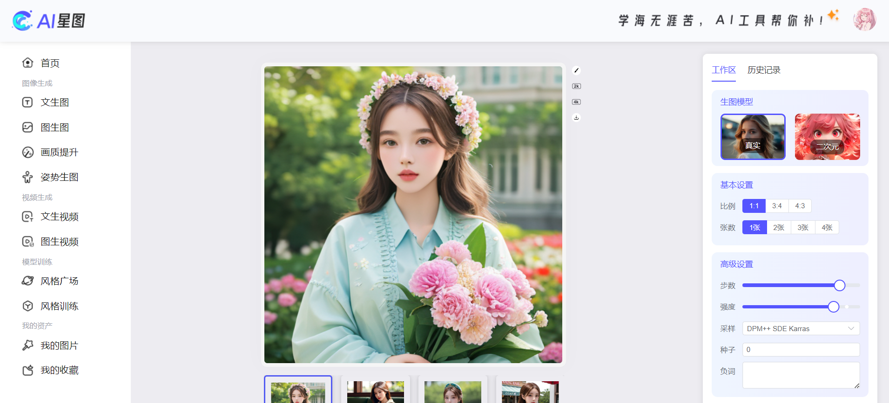
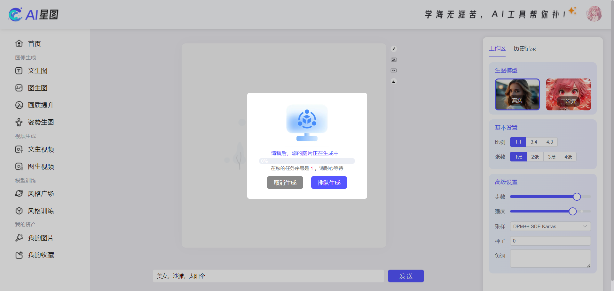
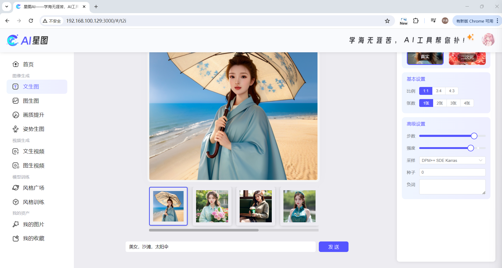

# Star Graph

## 项目结构

- star-graph/ 后端（Spring Boot, Java 17, Maven）
- star-graph-ui/ 前端（Vite, Vue 3, TypeScript）

## 后端技术栈

- Spring Boot 3.2（父项目）
- Java 17（maven.compiler.source/target）
- MyBatis-Plus 3.5.7（数据库访问）
- MySQL 8.0.33（驱动）
- Redis 与 Redisson 3.30.0（分布式特性）
- WebSocket STOMP（/ws，广播 /topic，点对点 /user）
- Retrofit2 2.11.0 + OkHttp Logging 4.11.0（HTTP 客户端）
- Fastjson2 2.0.31（JSON 序列化）

## 前端技术栈

- Vite 5（构建与开发服务器）
- Vue 3（应用框架）
- TypeScript
- Element Plus（UI 组件）
- Pinia + pinia-plugin-persist（状态管理）
- Axios（HTTP 客户端）
- @stomp/stompjs（WebSocket STOMP 客户端）

## 功能概览

- 文生图任务管理
  - 创建任务：`POST /api/authed/1.0/t2i/propmt`
  - 取消任务：`POST /api/authed/1.0/t2i/canel`
  - 历史记录：`POST /api/authed/1.0/t2i/list`
  - 任务插队：`POST /api/authed/1.0/t2i/proprity`
  - 实时排名：`POST /api/authed/1.0/t2i/rank`
- 实时推送
  - STOMP 端点：`/ws`
  - 广播目的地：`/topic/**`
  - 点对点目的地：`/user/**`

## 结果展示

